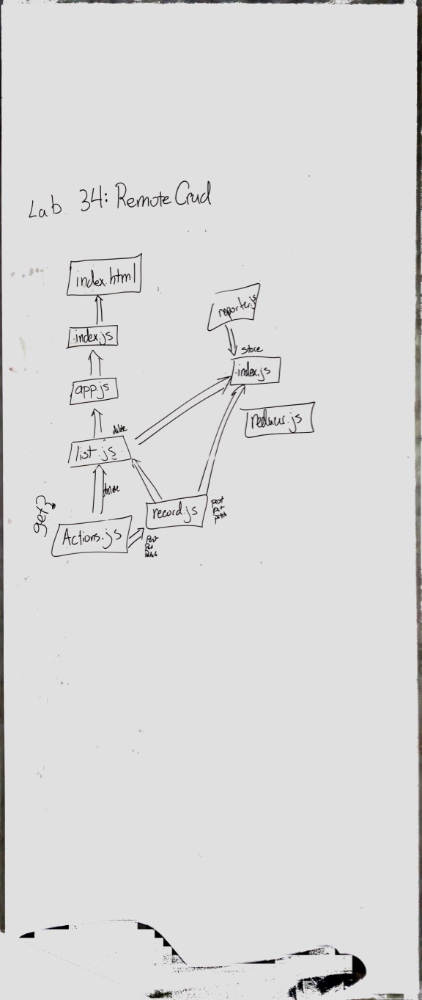

 LAB
=================================================

## Remote CRUD
### Author: Erin Trainor

_Note_: I am having an issue with the following error when I try to add a new player "Uncaught Error: A cross-origin error was thrown. React doesn't have access to the actual error object in development. See https://fb.me/react-crossorigin-error for more information." 

I can't figure out where it is coming from or how to fix it.
### Description
- [X] Remove the code that requires the .json file in your react app for the schema and adds it to state

- [X] Pull the schema from the remote server via the resource path /api/v1/players/schema (or whichever model you choose)

- [ ] On your first pull from the server of the database records, save them in the store for faster retrieval

- [ ] Instead of saving straight to the Redux Store, use an async action creator function to send data to the server (using post or put) and then update the local store

- [ ] When rendering the forms and lists, use the store as a cache, and update it after you save to the server.

- [ ] Testing

- [X] Styling

### Links, Resources and Documentation
* [PR](https://github.com/401-advanced-javascript-401d29/lab-34/pull/1)
* [Code Sandbox](https://codesandbox.io/s/kmon436rk5)

#### UML

